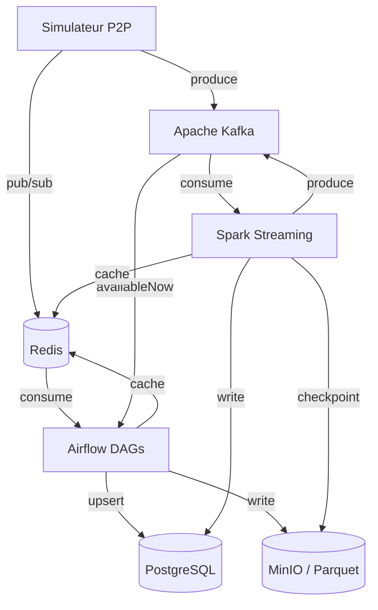

# Architecture SPOTIFY

> **À compléter par votre groupe** — Ce document doit décrire VOTRE architecture, pas celle de référence.

---

## Vision d'ensemble

```
[Insérer ici votre diagramme d'architecture]
Outil recommandé : draw.io, Excalidraw, ou Mermaid (ci-dessous)
```



---

## Décisions architecturales

### ETL vs ELT — Mapping par pipeline

| Pipeline | Approche | Justification |
|----------|----------|---------------|
| catalog_ingestion | ETL | ... |
| streaming_events | ... | ... |
| aggregation | ... | ... |
| streaming_trends (Spark) | ... | ... |

### Partitionnement Parquet

Expliquer ici votre stratégie de partitionnement des fichiers Parquet sur MinIO.

```
spotify-parquet/
└── listening_events/
    └── date=2025-01-15/
        └── hour=14/
            └── part-00000.parquet
```

**Pourquoi cette structure ?**
→ À compléter

### Topics Kafka — Stratégie de partitionnement

| Topic | Partitions | Clé | Justification |
|-------|-----------|-----|---------------|
| listening_events | 6 | user_id | ... |
| p2p_network_events | 6 | peer_id | ... |
| catalog_updates | 3 | track_id | ... |
| fraud_alerts | 3 | user_id | ... |

**Pourquoi `user_id` comme clé pour `listening_events` ?**
→ À compléter

---

## Choix techniques

### Pourquoi CeleryExecutor (pas KubernetesExecutor) ?

→ À compléter

### Gestion des secrets

→ Comment votre groupe gère les credentials (PostgreSQL password, MinIO keys...) ?

---

## Architecture Lambda — Batch + Speed Layer

```
Speed layer  : Simulateur → Kafka → Spark → PostgreSQL (realtime_*) + Redis
Batch layer  : Simulateur → Kafka (availableNow) → Airflow → PostgreSQL (daily_*) + MinIO
Serving layer: PostgreSQL + Redis ← consommé par les clients
```

**Ce qui est en batch et pourquoi :**
→ À compléter

**Ce qui est en streaming et pourquoi :**
→ À compléter

---

## Schémas d'événements

### listening_event

```json
{
  "event_id":    "uuid",
  "user_id":     "uuid",
  "track_id":    "uuid",
  "source_peer": "uuid",
  "timestamp":   "2025-01-15T14:30:00Z",
  "duration_ms": 45000,
  "device_type": "mobile",
  "geo_country": "FR",
  "completed":   true,
  "event_source": "p2p"
}
```

### p2p_network_event

```json
{
  "event_id":   "uuid",
  "event_type": "chunk_transfer",
  "peer_id":    "uuid",
  "target_peer": "uuid",
  "track_id":   "uuid",
  "chunk_size_bytes": 65536,
  "latency_ms": 12,
  "timestamp":  "2025-01-15T14:30:01Z"
}
```

---

## Leçons apprises

> À compléter au fur et à mesure de la semaine.

- **Lundi** : ...
- **Mardi** : ...
- **Mercredi** : ...
- **Jeudi** : ...
- **Vendredi** : ...
